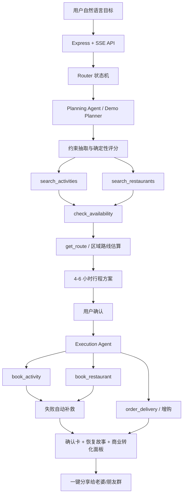

# 美团本地生活执行 Agent

> 赛题 06：本地探索——周末闲时活动规划 | 美团 AI Hackathon

**在线体验：[https://meituanagent.zeabur.app/](https://meituanagent.zeabur.app/)**

一句话定位：把”今天下午想出去玩几个小时”变成可执行的本地生活订单链路。

这不是一个普通推荐器。它不只告诉用户”可以去哪”，而是完成 **需求理解 → 规划 → 校验 → 预订执行 → 失败恢复 → 分享确认** 的闭环：先根据家庭/朋友/情侣/单人/团建场景生成 4-6 小时方案，再检查活动票量、餐厅座位和路线合理性，用户确认后执行 Mock 预约/下单，并输出可直接发给家人或朋友的确认消息。

## 核心价值主张

周末临时出门的难点不是“搜索一个地点”，而是连续决策和执行：孩子能不能玩、老婆减脂能不能吃、4 个朋友能不能成局、餐厅有没有位、活动是否需要预约、路线是否太远、失败后怎么补救。本项目把这些分散动作收束成一个本地生活执行 Agent，让用户把“安排一个下午”交给系统完成。

## 4 个核心卖点

| 卖点 | 评委能看到什么 | 代码支撑 |
|---|---|---|
| **闭环执行引擎** | 从自然语言目标到行程卡，再到 Mock 预约、订座、增购和确认号 | `src/agent/closed-loop.ts`、`src/agent/demo.ts` |
| **约束解释卡** | 明确解释为什么适合 5 岁孩子、为什么满足减脂、为什么路线不远 | `ConstraintExplanation`、评分与筛选规则 |
| **失败自动补救** | 餐厅无位或活动满员时，自动搜索同区/近区替代项并改订 | `recoverBookingFailure`、`RecoveryStory` |
| **一键确认与分享 + 商业转化面板** | 生成给老婆/朋友群的确认文案，并展示票务、订座、优惠券、增购转化 | `ConfirmationCard`、`BusinessConversion` |

## 在线体验

已部署至公网，无需本地安装：

**[https://meituanagent.zeabur.app/](https://meituanagent.zeabur.app/)**

## 本地运行

```bash
npm install
npm run dev
# 打开 http://localhost:3000
```

没有 `DEEPSEEK_API_KEY` 时会自动进入本地 Demo fallback，仍可完整展示工具调用链路、规划结果、Mock 预订结果和分享文案。也可以显式开启：

```bash
DEMO_MODE=true npm run dev
```

Windows PowerShell：

```powershell
$env:DEMO_MODE="true"; npm run dev
```

常用脚本：

```bash
npm run dev      # 启动 TypeScript 开发服务
npm run build    # 编译到 dist/
npm start        # 运行编译后的服务
npm test         # 运行 Vitest 单元/集成测试
```

## 系统架构图



## 核心流程图

```text
用户输入
  ↓
识别场景与约束
  - 家庭：5 岁孩子、老婆减脂、距离不远
  - 朋友：4 人、互动、聚餐、预算和氛围
  ↓
搜索活动与餐厅
  ↓
校验票量/座位/时间段
  ↓
生成路线和 4-6 小时行程
  ↓
等待用户确认
  ↓
执行 Mock 预订/订座/增购
  ↓
如失败：同区或近区自动替换并改订
  ↓
输出确认卡、分享文案、商业转化结果
```

## 评审维度对照表

| 评审维度 | 本项目对应能力 |
|---|---|
| **创新性** | 从“搜索推荐”升级为“本地生活执行 Agent”；把工具调用、状态机、确定性校验和失败恢复组合成可执行闭环 |
| **完整性** | Web UI + SSE 流式事件 + Mock API + 规划/执行/恢复/分享全链路 + 单元/集成测试 |
| **应用效果** | 覆盖家庭/朋友/情侣/单人/团建 5 种场景，显式处理年龄、饮食、人数、距离、可用性和路线衔接 |
| **商业价值** | 把活动票、餐厅订座、配送/优惠券增购串成组合转化路径，展示平台 GMV 和商家拆分 |
| **稳定性** | 无 API Key 可跑 Demo fallback；执行阶段使用确定性逻辑，测试覆盖状态机、预订守卫、恢复和局部重规划 |

## 5 个典型测试场景

| 场景 | 输入示例 | 预期展示 |
|---|---|---|
| 家庭亲子 + 减脂 | `今天下午想带 5 岁孩子和老婆出去玩几个小时，别离家太远，老婆最近在减肥` | 亲子活动、低负担餐厅、孩子年龄解释、给老婆的分享文案 |
| 朋友 4 人局 | `今天下午 4 个朋友出去玩，2 男 2 女，想有互动也要吃饭，别太远` | 适合 4 人的活动和聚餐，路线合理，群聊分享文案 |
| 餐厅无位恢复 | `今天下午带老婆孩子出去玩，餐厅满了也要自动换一个` | 先出现订座失败，再展示替代餐厅、恢复类型和新确认号 |
| 活动售罄恢复 | `今天下午 4 个朋友出去玩，如果活动售罄就换一个` | 活动预订失败后自动选择替代活动并继续执行 |
| 外部反馈局部重规划 | `老婆说餐厅太油了，换个清淡点的` / `朋友说太远了` | 保留可用部分，只替换餐厅或路线相关节点，更新分享文案 |

## 异常恢复演示说明

评审演示时可以重点展示“失败自动补救”，因为它最能区分执行 Agent 和普通推荐器。

1. 先输入家庭或朋友场景，生成行程。
2. 再使用包含失败意图的输入，例如“餐厅满了”或“活动售罄”。
3. 页面会展示工具时间线：原预订失败 → 搜索替代项 → 校验可用性 → 改订成功。
4. 最终结果包含 `recovered` 状态、替代商家/活动、确认号、恢复故事和更新后的分享文案。

对应测试覆盖包括：

- `closed-loop-agent.test.ts`：家庭/朋友闭环、餐厅恢复、活动恢复、工具时间线。
- `business-realism.test.ts`：可用性状态、排队判断、商业转化卡、结构化确认信息。
- `plan-revision.test.ts`：老婆/朋友/群聊/孩子反馈后的局部重规划。
- `booking-tools.test.ts`：预订 ID 类型守卫、重复预订拦截、错误返回。
- `router.test.ts` 和 `state.test.ts`：会话状态流转和确认/修改路由。

## 技术栈

| 层 | 技术 | 说明 |
|---|---|---|
| 前端 | 原生 HTML/CSS/JS | 展示聊天、工具时间线、行程卡和确认结果 |
| 后端 | Node.js + Express 5 | 提供静态页面、健康检查、SSE 流式接口 |
| Agent | TypeScript + AI SDK | 支持 DeepSeek 调用；无 Key 时走本地 Demo fallback |
| 数据 | 本地 Mock 数据 | 活动、餐厅、票量/座位、优惠券、路线估算 |
| 测试 | Vitest + Playwright 配置 | 覆盖核心规划、执行、恢复、状态机和 E2E 基础配置 |

## API 一览

- `GET /api/health`：检查服务状态、模型配置和 API Key 可见性。
- `POST /api/chat`：SSE 流式聊天入口，返回 thinking、tool_call、tool_result、plan_ready、booking_complete 等事件。
- `GET /api/plan/:sessionId`：获取当前会话状态和已生成方案。

## 项目目录说明

```text
.
├── public/                  # Web Demo 静态页面
├── src/
│   ├── agent/               # 规划、执行、闭环 Demo、局部重规划和路由
│   │   ├── closed-loop.ts   # 闭环执行引擎、约束解释、失败恢复、商业转化
│   │   ├── demo.ts          # 无 API Key 时的本地可演示路径
│   │   ├── planning.ts      # LLM Planning Agent 入口
│   │   ├── execution.ts     # 执行 Agent 入口
│   │   └── revision.ts      # 外部反馈后的局部重规划
│   ├── mock/                # 餐厅、活动、优惠券和可用性 Mock 数据
│   ├── tools/               # AI SDK 工具定义、执行处理和注册
│   ├── __tests__/           # 单元/集成测试
│   ├── server.ts            # Express + SSE 服务入口
│   ├── state.ts             # 会话状态机
│   └── types.ts             # 核心类型定义
├── docs/
│   ├── hackathon-demo-brief.md
│   ├── architecture.md
│   └── eval-rubric-and-tests.md
├── package.json
├── vitest.config.ts
└── playwright.config.ts
```

